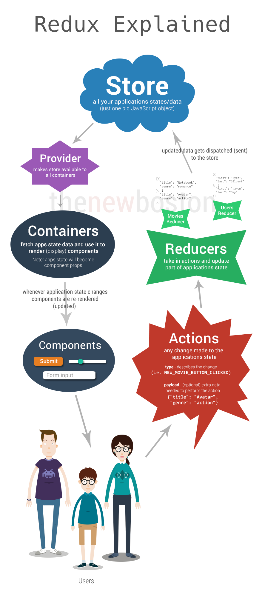

# react-redux-exercise
Exercise to understand better react-redux, how it works and how to use it.

**If you like this repo and/or learnt something from it, please give us a star :) Thanks!**

## Install

`git clone https://github.com/springload/react-redux-exercise.git`

`cd react-redux-exercise`

`npm install`

`npm run start`

And if you want some `eslint` love:

`npm run lint .` (or specify the path to the file you want to check)

## Redux

### with images

Source https://www.reddit.com/r/webdev/comments/4r1947/i_am_working_on_a_reactredux_video_tutorial/

Source http://staltz.com/unidirectional-user-interface-architectures.html

Source http://blog.tighten.co/react-101-using-redux

### with words

Don't be afraid by these images if you find them complicated.
Redux just needs to be tested and you will pick it up.

Basically, a Redux cycle works like this:
- A user clicks on a button on the UI (for instance)
- This button dispatches an action
- This action will be managed by a reducer which is listening for one or many actions
- This reducer will update the store state
- The new store is then passed to the component which rerenders with the new value
